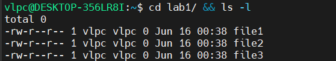
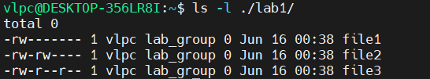
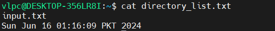
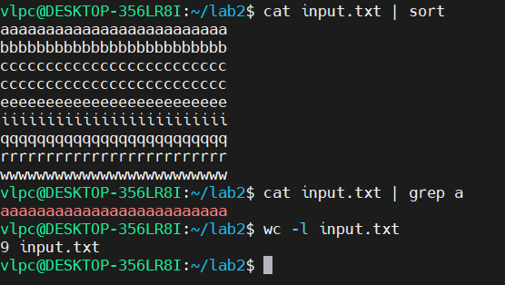
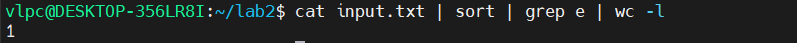
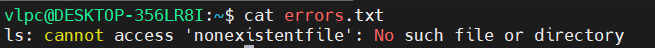

# Main Report

## 1

``` bash
sudo chmod 600 file1
sudo chmod 660 file2
sudo chmod 644 file3
```


## 2





## 3
### 3.1 [скрипт, который запрашивает имя пользователя](name-scrpt.sh)
### 3.2 [скрипт, который автоматизирует установку прав доступа](./permissions-scrpt.sh)
### 3.3 [скрипт, который отсортировывает файл](./file_sorting-scrpt.sh)
### 3.4 [скрипт, который проверяет, является ли число положительным, отрицательным или нулем](./number-scrpt.sh)
### 3.5 [скрипт, который выводит информацию о файле](./file_info-scrpt.sh)
### 3.6 [скрипт, который создает резервную копию заданного каталога](./archive-scrpt.sh)
### [Архив, сделанный скриптом 3.6](./backup_20240617.tar.gz)